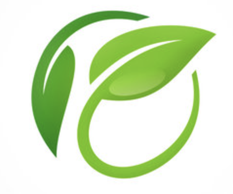

# AI-Powered Waste Sorting and Recycling Assistant



## Overview

The AI-Powered Waste Sorting and Recycling Assistant is a project dedicated to addressing the global waste management challenge. Our solution combines state-of-the-art computer vision and machine learning technologies to recognize and categorize waste items. By providing real-time guidance, educational resources, and community engagement, we aim to promote responsible waste management and recycling. ♻️🌍

## Key Features

- **Image Recognition**: Utilizes deep learning models to identify and classify various waste items, including plastics, paper, glass, metals, organics, and more. 📷🔍

- **Mobile App Interface**: Offers a user-friendly mobile app that allows users to capture images of waste items for instant recycling guidance. 📱

- **Educational Content**: Provides valuable information on recycling methods, the environmental impact of waste, and the locations of nearby recycling centers. 📚🏭

- **Community Engagement**: Encourages users to share their recycling achievements, participate in recycling challenges, and connect with a community that cares about the environment. 🤝🌳

- **Data Analytics**: Collects and analyzes user data to gain insights into recycling behavior and contribute valuable information to local authorities and environmental organizations. 📊📈

## Getting Started

To use or contribute to this project, follow these steps:

1. Clone the repository:

   ```bash
   git clone https://github.com/CODEWITHRIZA/AI-Powered-Waste-Sorting-and-Recycling-Assistant

2.Install the required libraries and dependencies:
      
    pip install -r requirements.txt
3. Run the main application:

    ```bash
  
   python3 main.py

## Future Improvements
-Integration with IoT devices for smart waste bins that can automatically sort waste.
-Gamification elements to encourage recycling, such as leaderboards and rewards.
-Collaboration with local waste management authorities to improve waste collection and recycling infrastructure. 🌟🤖

## Contact
For questions or inquiries, please contact codewithriza@gmail.com. ✉️
